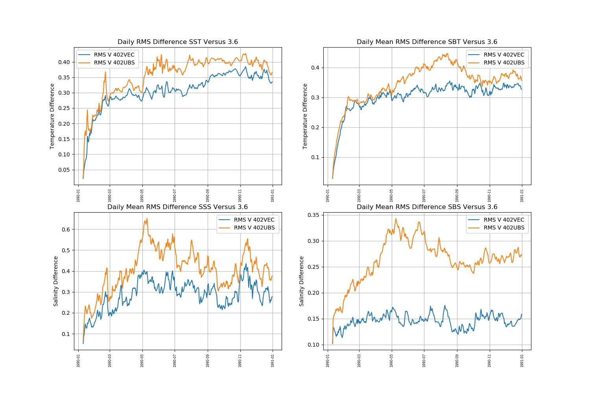

.. contents:: Table of Contents

***********
CO9p0_AMM15
***********

AMM15 in NEMOv4.0.? that is as close to Jenny's v3.6 configuration as possible.

Notes describing experiments to create CO9p0_AMM15
==================================================

v4.0.2: includes GLS boundary condition fix - 2 bugs (were self cancelling)

* Tidal skill slightly worse with the bugs fixed, though similar to CO8_AMM15
  Note: harmonic analysis is done offline using hourly SSH.

* SST near fronts better with bugs fixed

bilaplacian diffusion on momentum (coeff linear w/ momentum)
c.f. CO8_AMM15 "constant diffusion everywhere"

Forward look
============

UBS momentum advection:
  This will be required for W&D (and the vector invariant method will be eventually removed)

* doesn't run with bilap option 31 at 90 s.
  Switched it to grid scale dependence only (30)
  That helps a bit, as did switching to the same option for tracers
  (which had constant diffusion set similar to Jennys)
  and also switching to using implicit vertical advection
* Animation of surface and BED fields UBS V VEC (Rolling Monthly means)
.. raw:: html
 
 <iframe src="https://drive.google.com/file/d/1cAzmE0rsEWX7ZQegofYbO8SvZqWBk3Ab/preview" width="640" height="480"></iframe> 
 
* Time series comparison of rms difference betwewn Jenny's reference run and UBS and Vector Invar. momentmim advection

   

